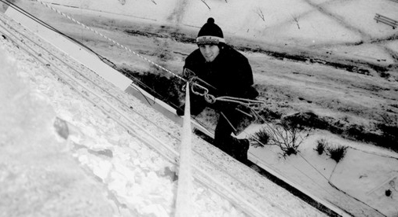

Зимові пейзажі надзвичайно красиві - засніжені дерева і вулиці, мальовничі бурульки, візерунки на склі. Але ця краса часто має сумні наслідки під час відлиг. Бурульки, намерзлі на дахах будівель, при падінні становлять загрозу для життя пішоходів. А сніг, що накопичився за зиму, при таненні може привести до протікання дахів.

Компанія «Сніговий барс» допоможе вам насолоджуватися зимової красою і уникнути неприємних наслідків танення снігу. Послуги компанії включають [зняття бурульок](/blog/uborka-snega-s-krysh/ "Видалення бурульок") і прибирання дахів.

Альпіністи-висотники видаляють бурульки в найрізноманітніших і недоступних для іншої техніки місцях. Щоб не перекривати рух по тротуару, працівники «Сніжного барса» можуть проводити роботи вночі. Така послуга особливо актуальна для торгових центрів. Торгові компанії зможуть проявити турботу про безпеку покупців, не завдаючи їм занепокоєння.

Також в будь-який час доби [промислові альпіністи](/blog/uborka-snega-s-krysh/) очистять вашу дах від снігу, оберігаючи її від протікань. В результаті ви зможете заощадити на дорогому ремонті перекриттів, збережіть чистий і красивий вид внутрішніх приміщень, не дасте можливості розвитку цвілі і грибка на відвологлих стінах.
