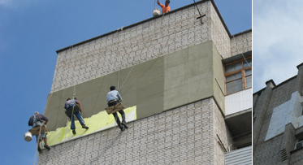
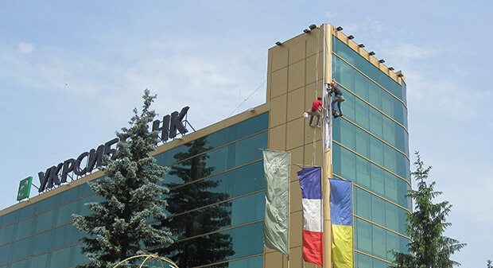
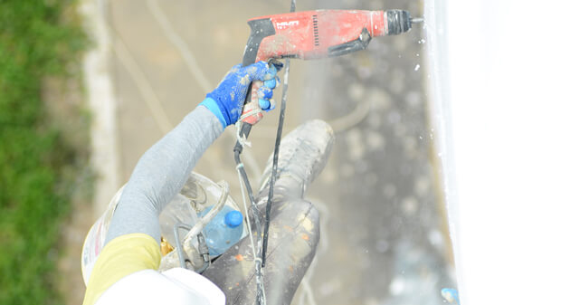

Компания Снежный Барс предоставляет услуги строительных работ методом промышленного альпинизма и другим работам на высоте.

Приглашаем Вас подробнее узнать о наших методах и [ценах](/ru/prajs/) на эти и [_другие услуги_](/ru/services/) промышленных альпинистов:

- [_Нанесение двухкомпонентных красок, мастик, жидкой резины_](/ru/services/nanesenie-specialnyx-pokrytij/) 
- [_Покраска стен, железо-бетона_](/ru/services/pokraska-betonnyh-konstrukcij/) 
- [_Покраска сверх-высоким давлением, безвоздушным способом_](/ru/services/pokraska-fasada/) 
- [_Покраска бочек_](/ru/tipy-obektov/rezervuary-dlya-zhidkostej/)

_«На высоту такую, милая, уж не посмотришь свысока!»_

Так звучит знаковая песня, которую альпинисты промышленные «берут» с собой на объект вместе с надежным снаряжением. Полжизни они проводят над землей, воплощая в жизнь типовые строительные проекты и индивидуальные заказы!

Отменное качество, экономичность и оперативность – три «кита», на которых основывается деятельность специалистов компании «Снежный Барс», то есть современный промышленный альпинизм. Цены, широта консультационного набора и спектра предоставляемых услуг Вас приятно удивят.

## Услуги промышленного альпинизма от «А» до «Я»

**Услуги альпиниста**- – это услуги специалиста широкого профиля, мастера «на все руки». Он способен качественно производить:

- _Фасадные_ _работы_. Косметический ремонт фасада, покраска стен дома, комплекс отделочных мероприятий – это экономичные способы придать конструкции дополнительные теплоизоляционные свойства, увеличить ее устойчивость и способность противостоять разрушительному воздействию окружающей среды. Профессиональные высотные работы предполагают навес вентилируемого фасада, его оформление с помощью современных изоляционных составов, герметиков. Оперативная и качественная реставрация стен не только повышает эксплуатационные характеристики строения, но и улучшает его внешний вид.
- _Герметизацию._ Стандартная покраска стен не обеспечивает защиту основных стыков, швов здания от промерзания, протечек. Для этого существуют специальные составы, призванные решить проблемы с оформлением оконных пространств и балконов. Их промышленные альпинисты подбирают индивидуально – в зависимости от структурных особенностей строения.

- _Клининговые работы._ Услуги промышленного альпинизма поистине незаменимы во время [очистки крыши здания от снега, наледи и сосулек](/ru/blog/uborka-snega-s-krysh/ "Очистка крыш домов от снега и сосулек"), [мойки стеклянных, оконных поверхностей, витрин и фасадов](/ru/services/kliningovye-uslugi/ "Мойка окон и витрин").
- _[Монтаж и демонтаж металлоконструкций, рекламных щитов](/ru/services/montazh-i-demontazh-reklamnyx-konstrukcij-shhitov-i-bannerov/ "Размещение наружной рекламы, установка, монтаж и демонтаж баннеров")._ 
- _Нестандартные высотные работы._ Альпинисты не лишены своеобразной романтичности и всегда готовы сделать приятный сюрприз "Оригинальный способ поздравить и удивить того, кто Вам дорог"), спустив букет цветов или подарок к окну. "Удивите своих близких оригинальным поздравлением") адресата.  
- Удаление и [кронирование деревьев](/ru/blog/obrezka-derevev/). 

## Промышленный альпинизм. 100 очков вперед

Из честного соревнования с другими способами организации высотных работ промышленный альпинизм не случайно выходит победителем. Его специфика и главные особенности определяют не только экономичность и выгодность, но и высокую скорость реализации проектов.

Альпинизм промышленный обеспечивает:

- _Возможность выполнения работ любого типа_, [начиная мойкой окон](/ru/services/kliningovye-uslugi/ "Мытье окон и фасадов зданий по доступным ценам и в кратчайшие сроки") и заканчивая [утеплением фасада](/ru/blog/naruzhnoe-uteplenie-sten-kvartir-domov/ "Внешнее утепление фасадов квартир") даже в труднодоступных местах. Там, где не пройдет крупногабаритная техника, с легкостью выполнят план опытные специалисты компании «Снежный Барс».
- _Мобильность группы и высокую скорость развертывания комплекса._ Услуги альпинистов дают возможность реализовывать проекты на любой высоте без остановки основной деятельности торговой организации, производственного предприятия, офисного центра. Мы экономим Ваше драгоценное время и денежные средства. Помните, что простой – это уже потеря!
- _Существенное снижение стоимости монтажных, отделочных работ и повышение скорости их выполнения._ Профессиональный промышленный альпинизм станет для Вас настоящей находкой в том случае, если Вы не хотите тратить внушительные денежные средства на привлечение подъемных механизмов, авто вышек, кранов и избегаете любого рода затягиваний, связанных с неисправностью техники или сложной транспортной ситуацией в городе.
- _Отсутствие каких бы то ни было ограничений при составлении заказа._ **Промальп** это  единственная возможность реализации надводных проектов, обслуживания конструкций на большой высоте и в стесненных условиях.
- _Высокую степень безопасности, надежности выполнения работ._ Промышленный альпинист, работающий в компании «Снежный Барс», обеспечивается высококачественным снаряжением и техническими средствами, прошедшими ряд международных сертификаций.
- _Широкий спектр реализуемых проектов, простота их организации_.

На любом из этапов выполнения строительного плана, при [установке рекламных конструкций](/ru/services/montazh-i-demontazh-reklamnyx-konstrukcij-shhitov-i-bannerov/ "Размещение наружной рекламы") и создании современной [фасадной теплоизоляции](/ru/blog/naruzhnoe-uteplenie-sten-kvartir-domov/ "Наружное утепление стен"), выполнении [клининговых](/ru/services/kliningovye-uslugi/ "Мытье окон и витрин, фасадов высотных зданий, и фасадов домов опытными альпинистами") и ремонтных работ, услуги промышленных альпинистов компании «Снежный Барс» будут максимально выгодным для Вас решением и перспективным вложением средств.

Получите 100% профессиональную отдачу от специалистов «Снежного Барса» и сделайте первый верный шаг навстречу успеху!
