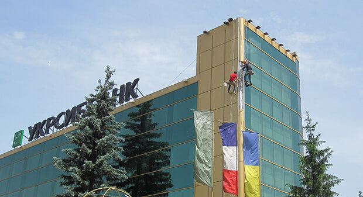
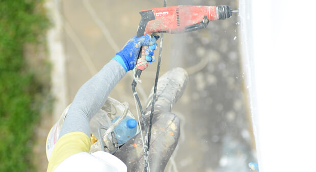

Компанія Сніжний Барс надає послуги будівельних робіт на висоті методом помислового альпінізму та інших робіт на висоті.

Запрошуємо Вас докладніше дізнатися про наші методи та [ціни](/prajs/) на ці та [_інші послуги_](/services/) промислових альпіністів:

- [_Нанесення двохкомпонентних фарб,мастик, рідкої гуми_](/services/nanesenie-specialnyx-pokrytij/) 
- [_Фарбування стін, залізо-бетона_](/services/pokraska-betonnyh-konstrukcij/) 
- [_Фарбування надвисоким тиском, безповітряним методом_](/services/pokraska-fasada/) 
- [_фарбування бочок_](/tipy-obektov/rezervuary-dlya-zhidkostej/)
  
_«На висоту таку, мила, чи не подивишся звисока!»_

Так звучить знакова пісня, яку альпіністи промислові «беруть» з собою на об'єкт разом з надійним спорядженням. Півжиття вони проводять над землею, втілюючи в життя типові будівельні проекти і індивідуальні замовлення!

Відмінна якість, економічність і оперативність - три «кити», на яких ґрунтується діяльність фахівців компанії «Сніжний Барс», тобто сучасний промисловий альпінізм. Ціни, широта консультаційного набору і спектра послуг, що надаються Вас приємно здивують.

## Послуги промислового альпінізму від «А» до «Я»

**Послуги альпініста** – це послуги фахівця широкого профілю, майстри «на всі руки». Він здатний якісно проводити:

- Фасадні работи. Косметичний ремонт фасаду, фарбування стін будинку, комплекс оздоблювальних заходів - це економічні способи надати конструкції додаткові теплоізоляційні властивості, збільшити її стійкість і здатність протистояти руйнівному впливу навколишнього середовища. Професійні висотні роботи припускають навіс вентильованого фасаду, його оформлення за допомогою сучасних ізоляційних матеріалів, герметиків. Оперативна і якісна реставрація стін не тільки підвищує експлуатаційні характеристики будівлі, але і покращує його зовнішній вигляд.
- Герметізацію. Стандартна фарбування стін не забезпечує захист основних стиків, швів будівлі від промерзання, протікання. Для цього існують спеціальні склади, покликані вирішити проблеми з оформленням віконних просторів і балконів. Їх промислові альпіністи підбирають індивідуально - залежно від структурних особливостей будови.

- Клінінгові роботи. Послуги промислового альпінізму справді незамінні під час [очищення даху будівлі від снігу, льоду та бурульок](/blog/uborka-snega-s-krysh/ "Очищення дахів будинків від снігу та бурульок"), [мийки скляних, віконних поверхонь, вітрин та фасадів](/services/kliningovye-uslugi/ "Миття вікон і вітрин").
- _[Монтаж і демонтаж металоконструкцій, рекламних щитів](/services/montazh-i-demontazh-reklamnyx-konstrukcij-shhitov-i-bannerov/ "Розміщення зовнішньої реклами, установка, монтаж і демонтаж банерів")._ 
- _Нестандартні висотні работи._ Альпіністи не позбавлені своєрідної романтичності і завжди готові зробити приємний сюрприз "Оригінальний спосіб привітати і здивувати того, хто Вам дорогий"), спустивши букет квітів або подарунок до вікна. "Здивуйте своїх близьких оригінальним привітанням") адресата.  
- _Видалення і [кронування дерев](/blog/obrezka-derevev/)._

## Промисловий альпінізм. 100 очок вперед

З чесного змагання з іншими способами організації висотних робіт промисловий альпінізм не випадково виходить переможцем. Його специфіка і головні особливості визначають не тільки економічність і вигідність, а й високу швидкість реалізації проектів.

Альпінізм промисловий забезпечує:

- Можливість виконання робіт будь-якого типу, [починаючи миттям вікон](/services/kliningovye-uslugi/ "Миття вікон і фасадів будинків за доступними цінами і в найкоротші терміни") і закінчуючи [утепленням фасаду](/blog/naruzhnoe-uteplenie-sten-kvartir-domov/ "Зовнішнє утеплення фасадів квартир") навіть у важкодоступних місцях. Там, де не пройде великогабаритна техніка, з легкістю виконають план досвідчені фахівці компанії «Сніжний Барс».
- _Мобільність групи і високу швидкість розгортання комплекса._ Послуги альпіністів дають можливість реалізовувати проекти на будь-якій висоті без зупинки основної діяльності торгової організації, виробничого підприємства, офісного центру. Ми економимо Ваш дорогоцінний час і кошти. Пам'ятайте, що простий - це вже втрата!
- _Сутєве зниження вартості монтажних, оздоблювальних робіт і підвищення швидкості їх реалізації._
- _Професійний промисловий альпінізм стане для Вас справжньою знахідкою в тому випадку, якщо Ви не хочете витрачати значні кошти на залучення підйомних механізмів, авто вишок, кранів і уникаєте будь-якого роду затягувань, пов'язаних з несправністю техніки або складної транспортної ситуацією в місті._
- _Відсутність яких би то не було обмежень при складанні замовлення._ **Промальп** це єдина можливість реалізації надводних проектів, обслуговування конструкцій на великій висоті і в умовах обмеженого простору.
- _Високую ступінь безпеки, надійності виконання робіт._ Промисловий альпініст, який працює в компанії «Сніжний Барс», забезпечується високоякісним спорядженням і технічними засобами, які пройшли ряд міжнародних сертифікацій.
- _Широкий спектр реалізованих проектів, простота їх організаціі_.

На будь-якому з етапів виконання будівельного плану, при [установці рекламних конструкцій](/services/montazh-i-demontazh-reklamnyx-konstrukcij-shhitov-i-bannerov/ "Розміщення зовнішньої реклами") і створенні сучасної [фасадної теплоізоляції](/blog/naruzhnoe-uteplenie-sten-kvartir-domov/ "Зовнішнє утеплення стін"), виконанні [клінінгових](/services/kliningovye-uslugi/ "Миття вікон і вітрин, фасадів висотних будівель, і фасадів будинків досвідченими альпіністами") і ремонтних робіт, послуги промислових альпіністів компанії «Сніжний Барс» будуть максимально вигідним для Вас рішенням і перспективним вкладенням коштів.

Отримайте 100% професійну віддачу від фахівців «Сніжного Барса» і зробіть перший вірний крок назустріч успіху!