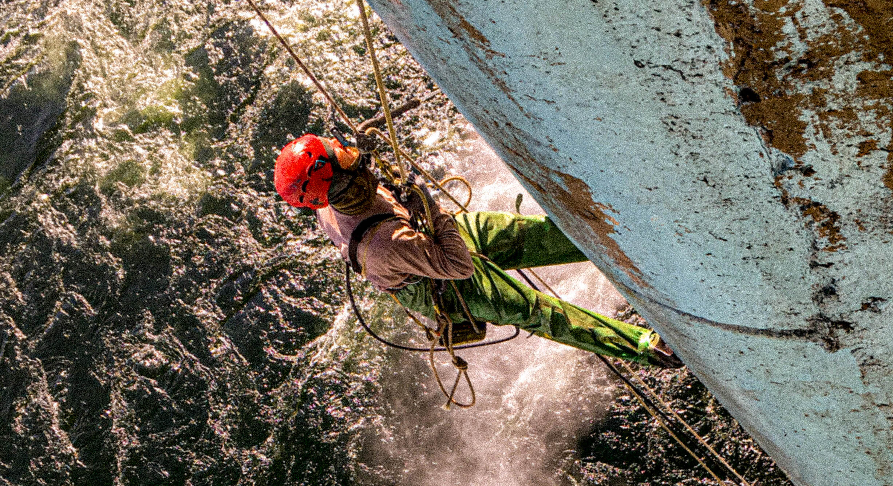

## Покраска и ремонт антикоррозионной защиты конструкций ГЭС, ТЕС, АЭС

Нанесение антикоррозионных покрытий, безвоздушная покраска металлоконструкций и малярные работы — одно из основных направлений деятельности альпинистов компании "Снежный Барс". На больших промышленных объектах таких, как электростанции, эти работы часто выполняются верхолазами. Маляра высотники незаменимы там, где работы выполняются на высоте больше 4х метров.

## Покрасочные работы, выполняемые промышленными альпинистами:

- [окрашивание наружных металлоконструкций](/ru/services/pokraska-metalla/);
- покраска несущих конструкций [производственных цехов](/ru/tipy-obektov/elevatory-promyshlennye-cexa/);
- [ремонт антикоррозийного покрытия козловых и мостовых кранов](/ru/tipy-obektov/krany-kozlovye-mostovye-portovye/) или резервуаров;
- гидроструйная очистка и [покраска железобетонных плотин](/ru/services/pokraska-betonnyh-konstrukcij/) гидроэлектростанций.
  

## Этапы работ по покраске:

Независимо от типа объекта и поверхности конструкции, будь то покраска железобетонной плотины ГЭС, или восстановление антикоррозионного покрытия несущих металлоконструкций ТЕС, этапы условно делятся на два, а именно:

### Подготовка, очистка поверхности

На этом этапе проводятся все мероприятия для обеспечения надежного сцепления ЛКМ (лакокрасочных материалов) с поверхностью. На металлоконструкциях, при необходимости, зачищаются участки, пораженные коррозией, проводится абразивная обработка поверхности. Обязательно с поверхности должны быть удалены все виды загрязнений: слои старого покрытия, которое отшелушивается, окалина, масла и другие посторонние частицы. Степень подготовки поверхностей к окрашиванию нормируется международными стандартами, государственными строительными нормами, и определяется требованиями производителя конкретного материала. И специалисты “Снежного Барса” строго придерживаются этих норм, даже в “специфических” и сложных условиях работы на электростанциях.

### Нанесение лакокрасочной системы

Как и подготовительные этапы, этот тоже имеет подразумевает использование специального оборудования. Какими именно методами воспользоваться, специалисты “Снежного Барса” определяют в каждом конкретном случае. Это зависит от самих производственных условий на электростанции. Самым оптимальным является аппаратное безвоздушное нанесение. Такой метод позволяет в короткие сроки красить большие объемы, без потери качества. Но такой способ не всегда возможен, из-за, например, риска развеивания краски. По большей части, нашим малярам-высотникам удается ограничить рабочую зону и выполнить безвоздушною покраску. Однако, иногда это невозможно из-за технических и экологических условий на объекте. В таких случаях, наши альпинисты красят ручным методом.

## Стоимость и технология покраски конструкций электростанции

Бюджет на такие верхолазные работы, определяется исходя из формы и сложности конструкции, высоты и сложности доступа к зоне окрашивания. Также большое влияние на выбор технологии и стоимости материалов окраски оказывает текущее состояние самих окрашиваемых поверхностей.

Обращайтесь к высотникам “[Снежного Барса](/ru/)” и Вы получите полную консультацию по технологиям и материалам, оптимальным для Вашего предприятия.

