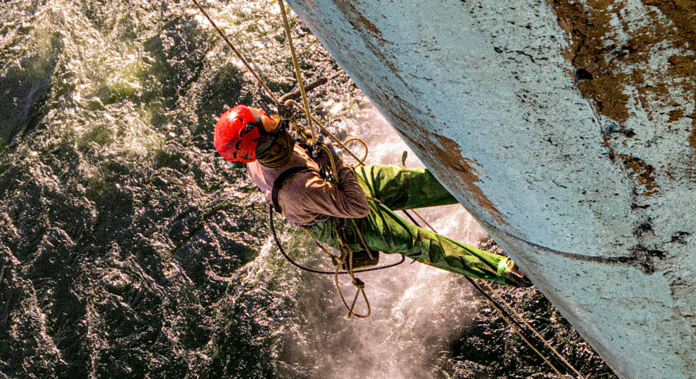

## Фарбування і ремонт антикорозійного захисту сталевих конструкцій ГЕС, ТЕС, АЕС

Нанесення антикорозійного покриття, безповітряне фарбування металоконструкцій та малярні роботи - один з основних напрямків діяльності альпіністів компанії "Сніжний Барс". На великих промислових об'єктах, таких, як електростанції, ці роботи часто виконуються верхолазами. Маляра-висотники незамінні там, де роботи виконуються на висоті більше 4-х метрів.

## Фарбувальні роботи, що виконуються промисловими альпіністами:

- [фарбування зовнішніх металоконструкцій](/services/pokraska-metalla/);
- фарбування несучих конструкцій [виробничих цехів](/tipy-obektov/elevatory-promyshlennye-cexa/);
- [ремонт антикорозійного покриття козлових і мостових кранів](/tipy-obektov/krany-kozlovye-mostovye-portovye/) або резервуарів;
- гідроструйне очищення і [фарбування залізобетонних гребель](/services/pokraska-betonnyh-konstrukcij/) гідроелектростанцій.
  

## Етапи робіт з фарбування:

Незалежно від типу об'єкта і поверхні конструкції, будь то фарбування залізобетонної греблі ГЕС, або відновлення антикорозійного покриття несучих металоконструкцій ТЕС, етапи умовно діляться на два, а саме:

### Підготовка, очищення поверхні

На цьому етапі проводяться всі заходи для забезпечення надійного зчеплення ЛФМ (лакофарбових матеріалів) з поверхнею. На металоконструкціях, за необхідності, зачищаються ділянки, уражені корозією, проводиться абразивна обробка поверхонь. Обов'язково з поверхні повинні бути вилучені всі види забруднень: шари старого покриття, яке відлущується, окалина, масла і інші сторонні частинки. Ступінь підготовки поверхонь до фарбування нормується міжнародними стандартами, державними будівельними нормами, і визначається вимогами виробника конкретного матеріалу. І фахівці "Сніжного Барса" чітко дотримуються цих норм, навіть у "специфічних" і складних умовах роботи на електростанціях.

### Нанесення лакофарбової системи

Як і підготовчі етапи, даний етап також вимагає використання спеціального обладнання. Якими саме методами скористатися, фахівці "Сніжного Барса" визначають в кожному конкретному випадку. Це залежить від самих виробничих умов на електростанції. Найоптимальнішим є апаратне безповітряне нанесення. Такий метод дозволяє в короткі терміни фарбувати великі обсяги, без втрати якості. Але такий спосіб не завжди можливий, через, наприклад, ризик розвіювання фарби. Здебільшого, нашим малярам-висотникам вдається обмежити робочу зону і виконати безповітряне фарбування. Однак, іноді це неможливо через технічні і екологічні умови на об'єкті. У таких випадках, наші альпіністи фарбують ручним методом.

## Вартість і технологія фарбування конструкцій електростанції

Бюджет на такі верхолазні роботи визначається, виходячи з форми і складності конструкції, висоти і складності доступу до зони фарбування. Також, на вибір технологій та вартість матеріалів фарбування впливає поточний стан самих конструкцій, шо підлягають фарбуванню.
 
Звертайтеся до висотників "[Сніжного Барса](/)" і Ви отримаєте повну консультацію щодо технологій і матеріалів, оптимальних для Вашого підприємства.
