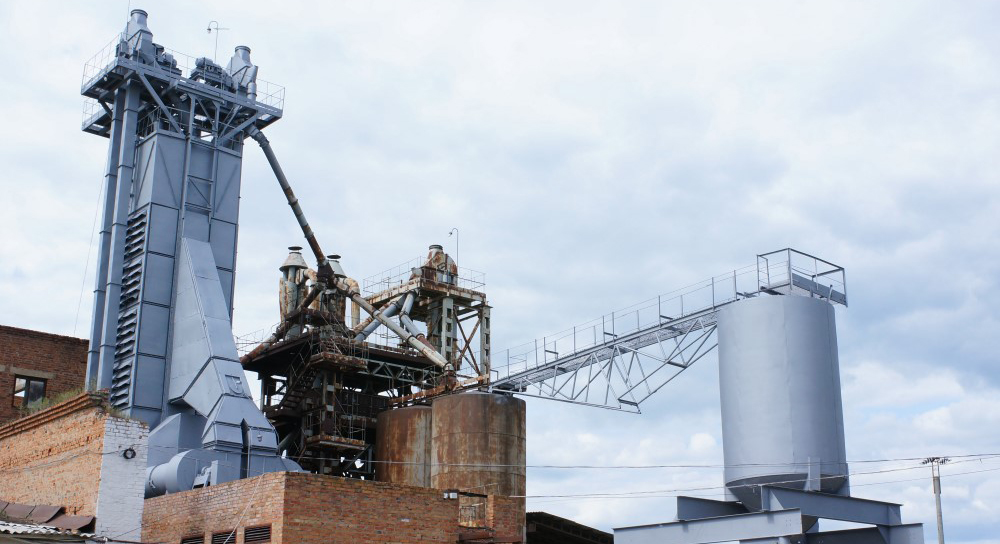

## ОБСЛУГОВУВАННЯ ЕЛЕВАТОРНИХ КОМПЛЕКСІВ ТА ПРОМИСЛОВИХ ЦЕХІВ ПО УКРАЇНІ

Сніжний Барс більше 10 років працює в галузі промислового альпінізму. Колектив підприємства складається з професійних альпіністів, які володіють досвідом роботи до 20 років. У складі бригад працюють фахівці різних кваліфікацій в т.ч. маляра, зварювальники, і інші.

За цей час накопичено величезний досвід роботи на елеваторних і промислових комплексах, що дозволяє з упевненістю братися за роботу підвищеної складності.

Ми знаємо «як і чим» необхідно ремонтувати шви і бетонні фасади силосів, шари антикорозійного захисту металоконструкцій, осадочної камери і оцинкованих силосів. А також ми знаємо, як непросто організувати роботу в виробничих цехах, адміністративних і службових будівлях діючого підприємства без зупинок.

### НАШЕ ОБЛАДНАННЯ ТА КВАЛІФІКАЦІЯ

Фарбувальне обладнання і професійний рівень фахівців в нашій команді дозволяють проводити роботи, при цьому звести до мінімуму призупинення виробничих процесів самого Замовника.

## ПОСЛУГИ ПРОМИСЛОВИХ АЛЬПІНІСТІВ КОМПАНІЇ "СНІЖНИЙ БАРС"

Наші послуги можуть включати як комплексні роботи, так виконання окремого процесу:

- Легка очистка металоконструкцій елеватора від забруднень гідроструменевим методом
- Підготовка поверхні до фарбування
- Гідроструминне очищення поверхонь апаратами високого тиску (> 250 атм.)
- Очищення від іржі металоконструкцій за стандартами ISO 8501-1
- Комплексний ремонт антикорозійного захисту
- Герметизація міжпанельних швів
- Ремонт зруйнованих поверхонь фасаду
- [Фарбування фасадів](/services/pokraska-betonnyh-konstrukcij/), стін, несучих конструкцій
- Грунтування і [фарбування складних металоконструкцій](/tipy-obektov/krany-kozlovye-mostovye-portovye/) і вантажопідйомних кранів
- Ремонт, фарбування, демонтаж димових труб
- [Монтаж рекламних конструкцій](/services/montazh-i-demontazh-reklamnyx-konstrukcij-shhitov-i-bannerov/)
- Герметизація покрівлі з нанесенням рідкої гуми
- [Нанесення спеціальних покриттів](/services/nanesenie-specialnyx-pokrytij/) (в т.ч. двокомпонентних поліуретанових систем)
- [Утеплення фасадів](/services/uteplenie-sten-i-fasadov/)
- Монтажно-зварювальні роботи

### ІНДИВІДУАЛЬНИЙ ПІДХІД ДО РІЗНОМАНІТНИХ КОНСТРУКЦІЙ 

Ми розуміємо, що виробничі умови на кожному об'єкті різні і це вимагає індивідуального підходу, не тільки до організації робіт. Але і до підбору оптимальних технологій і матеріалів.

У виборі лакофарбових матеріалів ми в першу чергу шукаємо оптимальну систему антикорозійного захисту для конкретних умов експлуатації.

Надважливо визначити яке фізико-хімічне навантаження буде на покриття. Чи буде це вплив природних факторів (таких як дощ і морське повітря, наприклад), або конструкція піддається впливу агресивного середовища (наприклад металургійні комбінати, де в цехах можуть бути в рази підвищено норми азоту і сірки).

Залежно від всіх цих факторів ми застосовуємо різні матеріали, в тому числі і покриття на поліуретановій основі, або ж інші двокомпонентні [спеціальні покриття](/services/nanesenie-specialnyx-pokrytij/).

Ми готові виїхати до Вас на об'єкт для детального обговорення фронту робіт, і в найкоротші терміни надамо Вам детальну пропозицію по їх виконанню, відповідно до технічного завдання та виробничих умов на Вашому підприємстві.

Важливим фактором є також наявність професійної техніки, яка в значній мірі підвищує якість роботи і дозволяє домагатися потрібних результатів в стислі терміни. За рахунок механізації більшості процесів, а також надійності фарбувальних станцій, [висотники "Сніжного Барса"](/) можуть якісно виконувати фарбувальні роботи в великих обсягах на різних за складністю і умовами об'єктах.

Все обладнання в сфері промислового альпініста (від гідроструминних і фарбувальних агрегатів до аксесуарів) має бути мобільним, легким і зручним для використання "з мотузок". Це істотно впливає як на якість виконання робіт, так і на безпеку.

Саме такий підхід до роботи у "Сніжного Барса" - швидко, якісно і дотримуючись усіх вимог Охорони праці.