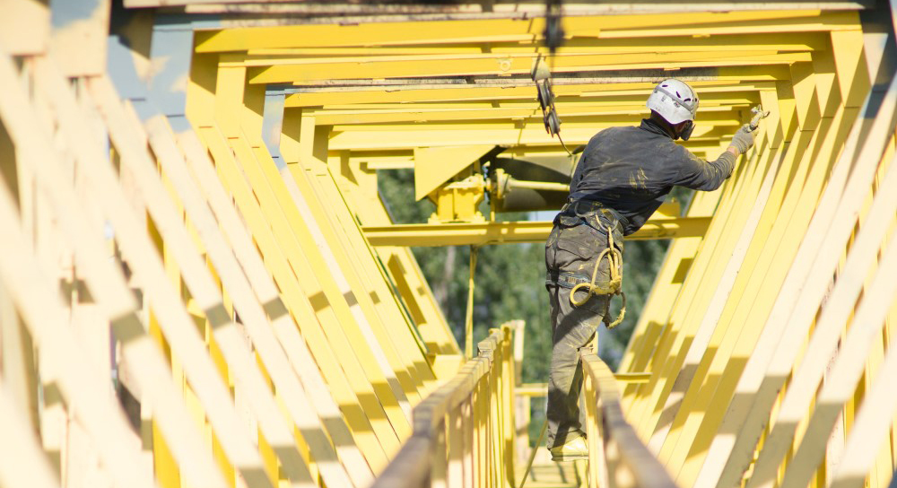

## Фарбування кранів: Мостових, Козлових, Портальних в Україні

Крани козлові, мостові і портальні - це металоконструкції, які постійно перебувають на відкритому просторі і при цьому несуть колосальні фізичні навантаження. Відповідно, з часом відбувається знос антикорозійного захисного покриття, що може привести до іржавіння самої конструкції та виводу вантажопідіймального крана з експлуатації.

Необхідно регулярно проводити [ремонт антикорозійного покриття](/services/pokraska-metalla/), щоб захистити металоконструкцію крана від негативного впливу навколишнього середовища, в тому числі дощів, снігу, прямих сонячних променів і ряду інших факторів (наприклад: кран експлуатується в виробничому цеху з підвищеним вмістом агресивних речовин).

Своєчасно проведена очистка та фарбування кранів забезпечить більш тривалий термін їх служби без поломок, пошкоджень та інших дефектів.

Кваліфіковані, досвідчені фахівці нашої компанії виконають всі роботи по фарбуванню кранів і інших металоконструкцій в Україні. Якісно і оперативно, з дотриманням всіх технологічних вимог, що пред'являються до подібних робіт.

Для того, щоб запобігти зносу вантажопідйомної техніки, зупинити корозійні процеси і тим самим продовжити термін експлуатації, фахівці рекомендують регулярно здійснювати фарбування кранів.

### Верхолазні роботи з фарбування кранів

Фарбування великогабаритних кранів це - комплекс заходів, які виконуються промисловими альпіністами:

- знежирення поверхонь, в т.ч. хімічне очищення в зоні масляних нашарувань;

- гідроструйне очищення металоконструкцій від бруду, пилу і відшарувань старої фарби;

- захист від корозії (нанесення лакофарбового покриття, що відповідає умовам експлуатації)
  

## Переваги промислових альпіністів компанії "Сніжний Барс"

ВНаша команда - це кваліфіковані маляра-альпіністи з професійним технічним забезпеченням для виконання малярних робіт на висоті 20-ти і більше метрів.
Верхолази компанії "Сніжний Барс" мають великий досвід фарбування козлових, мостових, портальних кранів, і відповідне обладнання. В т.ч. апарати високого тиску для очищення металу та безповітряного нанесення антикорозійного покриття. 

Крім того, ми розуміємо, як важливі для діючого підприємства терміни виконання робіт з фарбування крана. Тому, ми прагнемо організувати роботи так, щоб виконати роботи в найкоротші терміни і мінімальному втручанні в виробничі процеси Вашого підприємства.

Також, у нас є досвід роботи з різними лакофарбовими матеріалами, в т.ч. поліуретановими та іншими двокомпонентними системами антикорозійного покриття. У разі, якщо технологічні умови не дозволяють виконати повну підготовку поверхні, або кран знаходиться в умовах впливу агресивних середовищ - наші фахівці допоможуть визначитися з оптимальними технологіями і матеріалами, придатними саме для Ваших умов на виробництві.

Якщо вам необхідні послуги кваліфікованих [промислових альпіністів](/) в Україні, для фарбування мостових, козлових і портальних кранів, звертайтеся в нашу спеціалізовану компанію.

