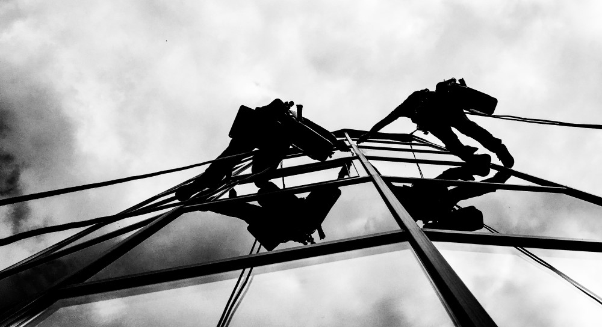

## Обслуживание зданий торгово-развлекательных комплексов альпинистами

Мы много лет сотрудничаем с различными торговыми центрами и офисными зданиями. Высотники «Снежного барса» умеют работать с исключительной аккуратностью и быть “невидимыми” для посетителей центров. Также используется индивидуальный подход к режиму работы с обеспечением всех необходимых норм безопасности.

## Монтаж и демонтаж рекламных конструкций

Наружная реклама — это имидж компании. И поэтому так важна установка рекламы именно в том месте, где это наиболее актуально для бизнеса. Наши альпинисты просто незаменимы там, где доступ технических средств затруднен или просто невозможен. Благодаря большому опыту альпинистов-высотников компании «Снежный барс» монтаж и демонтаж рекламы осуществляется быстро, качественно и надежно. К тому же, в зависимости от обстоятельств, установка рекламных конструкций возможна в ночное время. [Монтаж рекламных конструкций](/ru/services/montazh-i-demontazh-reklamnyx-konstrukcij-shhitov-i-bannerov/) со «Снежным Барсом» – это всегда высокое качество крепления, идеально выверенный угол наклона, безупречная подсветка и оперативность!

## Клининговые услуги: мойка стеклянных фасадов, очистка крыш

Мы производим [мойку окон и фасадов](/ru/services/kliningovye-uslugi/), витрин, а также очистку поверхностей и сложных конструктивных элементов на любой высоте. Все работы выполняют опытные альпинисты. Мытье окон осуществляется с использованием современных средств. Мы гарантируем Вам, что мойка окон и фасадной поверхности будет осуществлена в кратчайшие сроки, без нарушения установленного расписания работы организации.

## Монтаж и обслуживание фасадной электрики и праздничной иллюминации

[Промышленные альпинисты](/ru/) компании «Снежный барс» готовы помочь в монтаже нестандартных световых конструкций. Монтаж возможен на фасадах и крышах зданий, билбордах, над дорогами. То есть везде, где для этого есть соответствующие площади и опоры. Вы можете проявить креатив в рекламе или праздничном оформлении вашего торгового центра или офиса, а опытные альпинисты-высотники компании «Снежный барс» решат для вас задачу монтажа. Для монтажа световых конструкций в нашей команде есть альпинисты-электрики с допуском на работы с электричеством, что действительно очень важно для соблюдения техники безопасности на промышленных объектах и объектах общественного пользования.

## Малярные работы и защита металлоконструкций от коррозии

Здания общественного пользования требуют своевременного ремонта, и надежной [антикоррозионной защиты несущих металлических](/ru/services/pokraska-metalla/) и [бетонных конструкций](/ru/services/pokraska-betonnyh-konstrukcij/). Ведь кроме эстетического вида, которого требуют посетители комплекса, он должен отвечать всем требованиям норм безопасности. Квалификация наших специалистов и технологии позволяют выполнять малярные работы в кратчайшие сроки, что очень важно, как в случае ремонта помещений, так при вводе нового здания в эксплуатацию.

## Очистка крыш от снега и льда

Своевременное удаление сосулек, очистка кровельной поверхности и водостоков обеспечивают безопасность Ваших бизнес-партнеров и сотрудников офисов, случайных прохожих и покупателей в торговых комплексах, сити-моллах, а также являются гарантией сохранности основных инфраструктурных систем и ключевых элементов конструкции. Специалисты компании «Снежный Барс» уделяют особое внимание проработке плана уборки крыши и формированию индивидуального подхода к реализации каждого проекта. [Очистка крыши от снега](/ru/blog/uborka-snega-s-krysh/) зимой, производится преимущественно в светлое время суток. Однако опыт и квалификация наших альпинистов позволяют проводить эти работы и ночью, что особенно актуально для торговых центров.

