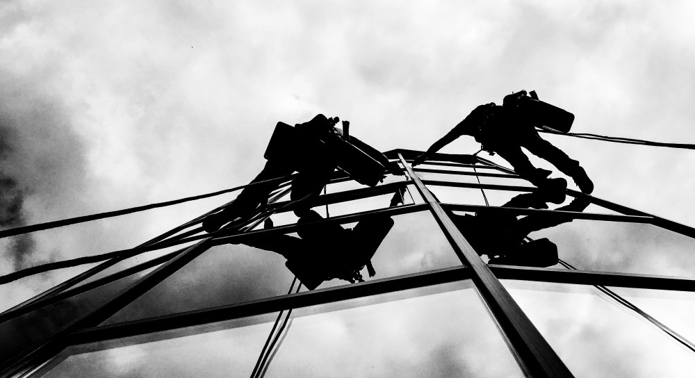

## Обслуговування будівель торгово-розважальних комплексів альпіністами

Ми багато років співпрацюємо з різними торговими центрами і офісними будівлями. Висотники «Сніжного барса» вміють працювати з винятковою акуратністю і бути "невидимими" для відвідувачів центрів. Також ми використовуємо індивідуальний підхід, до планування робіт відповідно режиму роботи громадського комплексу із забезпеченням усіх необхідних норм безпеки.

## Монтаж і демонтаж банера і рекламних конструкцій на висоті

Зовнішня реклама - це імідж компанії. І тому так важлива установка реклами саме в тому місці, де це найбільш актуально для бізнесу. Наші альпіністи просто незамінні там, де доступ технічних засобів ускладнений або просто неможливий. Завдяки великому досвіду альпіністів-висотників компанії «Сніжний Барс» монтаж і демонтаж реклами здійснюється швидко, якісно і надійно. До того ж, в залежності від обставин, установка рекламних конструкцій можлива в нічний час. [Монтаж рекламних конструкцій](/services/montazh-i-demontazh-reklamnyx-konstrukcij-shhitov-i-bannerov/) зі «Сніжним Барсом» - це завжди висока якість кріплення, ідеально вивірений кут нахилу, бездоганна підсвічування і оперативність!

## Клінінгові послуги: миття скляних фасадів, очищення дахів

Ми виконуємо [миття вікон і фасадів](/services/kliningovye-uslugi/), вітрин, а також очищення поверхонь і складних конструктивних елементів на будь-якій висоті. Всі роботи проводяться досвідченими альпіністами. Миття вікон здійснюється з використанням сучасних засобів. Ми гарантуємо Вам, що миття вітрини і фасадної поверхні буде здійснено в найкоротші терміни, без порушення встановленого розкладу роботи Вашого комплексу.

## Монтаж і обслуговування фасадної електрики і святкової ілюмінації

[Промислові альпіністи](/) компанії «Сніжний Барс» готові допомогти в монтажі нестандартних світлових конструкцій. Монтаж можливий на фасадах і дахах будівель, білбордах, над дорогами. Тобто всюди, де для цього є відповідні площі і опори. Ви можете проявити креатив в рекламі або святковому оформленні вашого торгового центру або офісу, а досвідчені альпіністи-висотники «Сніжного Барсу» вирішать для вас завдання монтажу. Для монтажу світлових конструкцій в нашій команді є альпіністи-електрики з допуском на роботи з електрикою, що дійсно дуже важливо для дотримання техніки безпеки на промислових об'єктах і об'єктах громадського користування.

## Малярські роботи і захист металоконструкцій від корозії

Громадські заклади вимагають своєчасного ремонту, і надійного [антикорозійного захисту несучих металевих](/services/pokraska-metalla/) і [бетонних конструкцій](/services/pokraska-betonnyh-konstrukcij/). Адже крім естетичного вигляду, якого вимагають відвідувачі комплексу, він повинен відповідати всім вимогам норм безпеки. Кваліфікація наших фахівців і технології дозволяють виконувати малярні роботи в найкоротші терміни, що дуже важливо, як у випадку ремонту приміщень, так при введенні нової будівлі в експлуатацію.

## Очищення дахів від снігу та льоду

Своєчасне видалення бурульок, очищення покрівельної поверхні і водостоків забезпечують безпеку Ваших бізнес-партнерів і співробітників офісів, випадкових перехожих і покупців в торгових комплексах, сіті-моллах. Також це заходи збереження основних інфраструктурних систем і ключових елементів конструкції. Фахівці компанії «Сніжний Барс» приділяють особливу увагу опрацюванню безпечного плану очистки даху і формування індивідуального підходу до реалізації кожного проекту. [Очищення даху від снігу](/blog/uborka-snega-s-krysh/) взимку, проводиться переважно в світлий час доби. Однак досвід і кваліфікація наших альпіністів дозволяють проводити ці роботи і вночі, що особливо актуально для торгових центрів.

