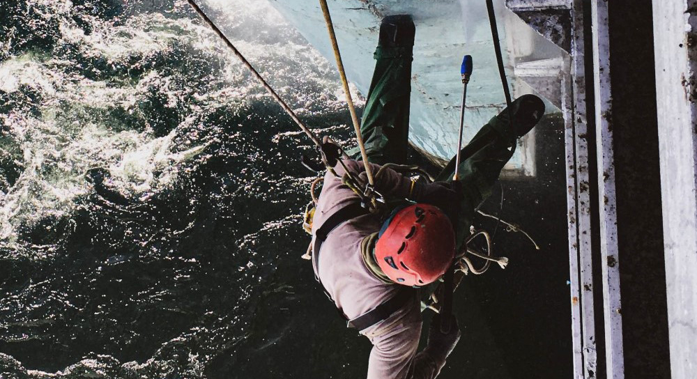

## Покраска путепроводов, мостов, эстакад на территории Украины

[Ремонт антикоррозийного покрытия металлоконструкций](/ru/services/pokraska-metalla/) и [покраска железобетонных элементов](/ru/services/pokraska-betonnyh-konstrukcij/) мостов и эстакад позволит своевременно остановить процесс коррозии, защищая конструкцию от разрушения.

[Альпинисты «Снежного Барса»](/ru/) имеют опыт очистных и малярных работ в “специфических” условиях: мы знаем, как безопасно и эффективно организовать покрасочные работы над непрерывными транспортными потоками, или над руслом реки. Поэтому лучше доверить окраску мостов и эстакад опытным альпинистам из компании “Снежный Барс”.

## Для чего нужна покраска мостов и эстакад?

Объемные элементы дорожной инфраструктуры, такие как мосты и эстакады, требуют обслуживания как технического, так и косметического. В частности, требуется регулярная окраска мостов и эстакад для сохранения их функциональности.

Мосты, путепроводы и эстакады относятся к сложным инженерным сооружениям. Эти конструкции предназначены, как правило, для движения различного транспорта (автомобили, железнодорожные составы). В связи с этим, на конструкцию мостов и эстакад оказывается достаточно колоссальная нагрузка. Под воздействием различных факторов, в том числе и осадков, металлоконструкции и железобетонные опоры мостов и эстакад изнашиваются. Что может повлечь за собой обрушения моста или эстакады.

Компания «Снежный Барс» предлагает услуги по покраске на высоте и в труднодоступных местах.
