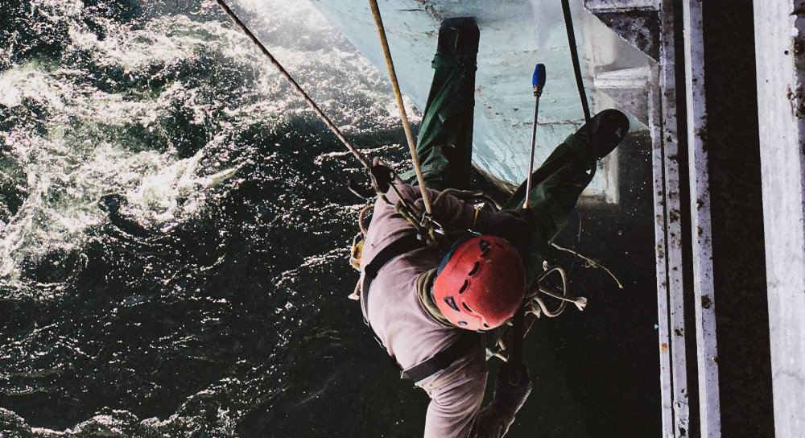

## Фарбування шляхопроводів, мостів, естакад на території України

[Ремонт антикорозійного покриття металоконструкцій](/services/pokraska-metalla/) і [фарбування залізобетонних елементів](/services/pokraska-betonnyh-konstrukcij/) мостів і естакад дозволить своєчасно зупинити процес корозії, захищаючи конструкцію від руйнування. 

[Альпіністи «Сніжного Барса»](/) мають досвід очисних і малярських робіт в "специфічних" умовах: ми знаємо, як безпечно і ефективно організувати фарбувальні роботи над безперервними транспортними потоками, або над руслом річки. Тому, краще довірити фарбування мостів і естакад досвідченим альпіністам команди "Сніжний Барс".

## Для чого потрібне фарбування мостів і естакад?

Об'ємні елементи дорожньої інфраструктури, такі як мости і естакади, вимагають обслуговування як технічного, так і косметичного. Зокрема, потрібне регулярне фарбування мостів і естакад для збереження їх функціональності.

Мости, шляхопроводи та естакади відносяться до складних інженерних споруд. Ці конструкції призначені, як правило, для руху різного транспорту (автомобілі, поїзди). У зв'язку з цим, на конструкцію мостів і естакад чиниться колосальне навантаження. Під впливом різних факторів, в тому числі і опадів, металоконструкції і залізобетонні опори мостів і естакад зношуються. Що може спричинити за собою руйнування моста або естакади. 

Компанія «Сніжний Барс» пропонує послуги з фарбування на висоті і у важкодоступних місцях.
