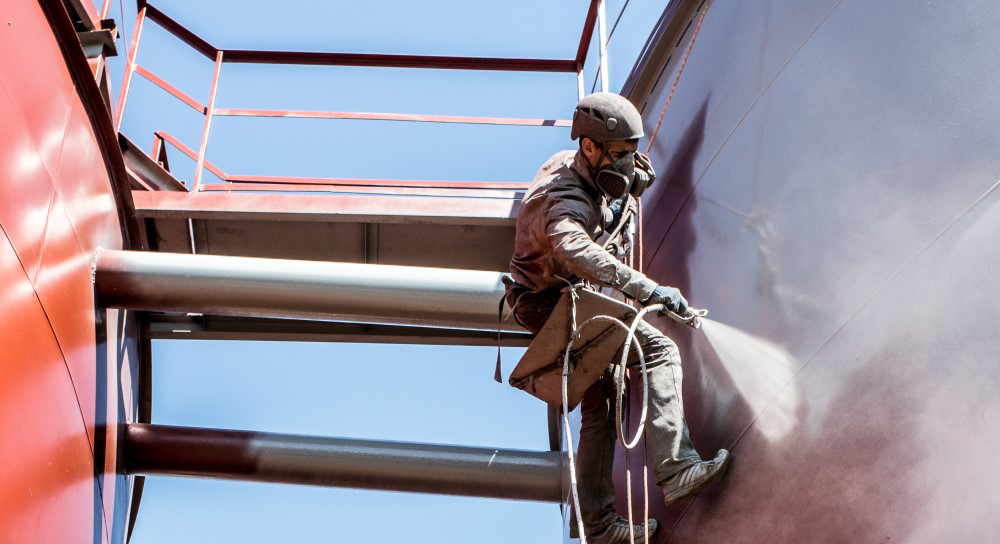

## Антикоррозионные покрытия для защиты металла от агрессивной среды

Впервые **защита от коррозии металлов** была упомянута в трудах Геродота (V век до н.э.). За две с половиной тысячи лет химики разработали множество способов, но наиболее распространенным остается нанесение на поверхность изделия или конструкции специальной пленки, непроницаемой для воды и кислорода.

А что делать, если [**антикоррозионная защита металла**](/ru/services/pokraska-metalla/) нужна не только от воздействия атмосферных явлений, но и от агрессивных сред? Очень просто: обратиться в компанию «Снежный барс»! Команда альпинистов, оснащенная необходимой техникой и обладающая соответствующими навыками, быстро выполнит все необходимые работы. И это будет _действительно быстро_ – наши сотрудники работают в три смены, круглые сутки, семь дней в неделю. Если вам важна скорость, работы могут вестись без остановки. Если же доступ к конструкциям в дневное время усложнен, мы ограничимся двумя сменами, и производство не придется останавливать ни на один день!

## Как производится антикоррозионная обработка?

Антикоррозионная защита металлических конструкций – сложный процесс. Даже если они эксплуатируются в обычных условиях, поверхность нужно тщательно подготовить: провести гидроструйную очистку поверхностей, удалив старое покрытие, масла, пыль и грязь и только после этого нанести защитный слой. В таком случае вложенные деньги будут работать на вас все последующие годы – правильно обработанная поверхность успешно противостоит ультрафиолету, влаге и другим воздействиям.

Но нередко антикоррозийная защита резервуаров и емкостей должна амортизировать и более сложные факторы. Например, воздействие пищевых кислот или других агрессивных химических растворов.

Нужна покраска многотонной цистерны, резервуара ГСМ, водонапорной башни или емкости пищевого предприятия? Пожалуйста! Опыт работы в самых разнообразных условиях и различными материалами (в т.ч. нанесение специальных покрытий/) позволяет гарантировать: все будет сделано по высшему разряду.

## Почему покраску резервуаров выполняют именно альпинисты?

Маляр-альпинист во многих случаях совершенно незаменим. Часто, к внешним поверхностям резервуара не подступиться с лесов или туры, из-за округлой формы емкости. Поэтому, покраска и антикор работы на резервуарах чаще всего выполняются «с веревок». Специальное снаряжение и опыт позволяют нашим сотрудникам успешно работать там, где ограничен доступ к зоне окраски. При этом [услуги альпинистов](/ru/services/) намного дешевле, чем эксплуатация сложной техники, обеспечивающей подъем рабочих на нужную высоту.

Какой бы сложности ни были окрашиваемые конструкции, и где бы они ни располагались, мы сможем разработать эффективный вариант нанесения антикоррозионного покрытия. Позвоните в «Снежный барс» – и ваш заказ будет выполнен в кратчайшие сроки!
