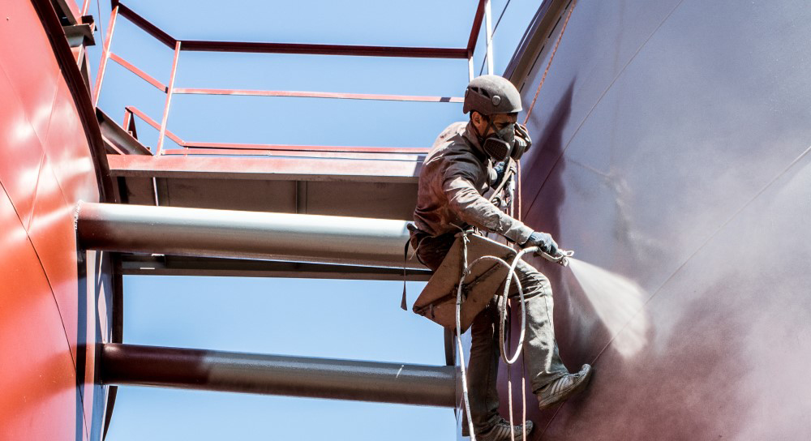

## Антикорозійні покриття для захисту металу від агресивного середовища

Вперше **захист від корозії металів** була згадана в працях Геродота (V століття до н.е.). За дві з половиною тисячі років хіміки розробили безліч способів, але найбільш поширеним залишається нанесення на поверхню виробу або конструкції спеціальної плівки, непроникною для води і кисню.

А що робити, якщо [**антикорозійний захист металу**](/services/pokraska-metalla/) потрібна не тільки від впливу атмосферних явищ, а й від агресивних середовищ? Дуже просто: звернутися в компанію «Сніжний барс»! Команда альпіністів, оснащена необхідною технікою і володіє відповідними навичками, швидко виконає всі необхідні роботи. І це буде _дійсно швидко_ - наші співробітники працюють в три зміни, цілодобово, сім днів на тиждень. Якщо вам важлива швидкість, роботи можуть вестися без зупинки. Якщо ж доступ до конструкцій в денний час ускладнений, ми обмежимося двома змінами, і виробництво не доведеться зупиняти ні на один день!

## Як проводиться антикорозійна обробка?

Антикорозійний захист металевих конструкцій - складний процес. Навіть якщо вони експлуатуються в звичайних умовах, поверхню потрібно ретельно підготувати: провести гідроструминне очищення поверхонь, видаливши старе пошкоджене покриття, масла, пил і бруд, і тільки після цього нанести захисний шар. В такому випадку вкладені гроші будуть працювати на вас всі наступні роки - правильно оброблена поверхня успішно протистоїть ультрафіолету, вологи та інших впливів.

Але нерідко антикорозійний захист резервуарів і ємностей повинен амортизувати і більш складні фактори. Наприклад, вплив харчових кислот або інших агресивних хімічних розчинів.

Потрібне фарбування багатотонної цистерни, резервуара РВС, водонапірної башти або ємності харчового підприємства? Будь ласка! Досвід роботи в найрізноманітніших умовах і різними матеріалами (в т.ч. нанесення спеціальних покриттів/) дозволяє гарантувати: все буде зроблено по вищому розряду.

## Чому фарбування резервуарів виконують саме альпіністи?

Маляр-альпініст в багатьох випадках абсолютно незамінний. Часто, до зовнішніх поверхонь резервуара не підступитися з лісів або тури, через округлу форму ємності. Тому, фарбування і антикор роботи на резервуарах найчастіше виконуються «з мотузок». Спеціальне спорядження та досвід дозволяють нашим співробітникам успішно працювати там, де обмежений доступ до зони фарбування. При цьому [послуги альпіністів](/services/) набагато дешевше, ніж експлуатація складної техніки, що забезпечує підйом робітників на потрібну висоту.
Якої б складності не були конструкції, що підлягають фарбуванню, і де б вони не розташовувалися, ми зможемо розробити ефективний варіант нанесення антикорозійного покриття. Зателефонуйте в «Сніжний барс» - і ваше замовлення буде виконано в найкоротші терміни!
