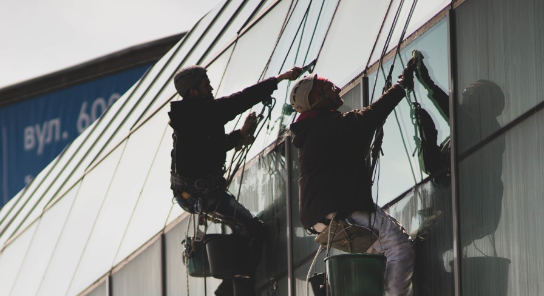
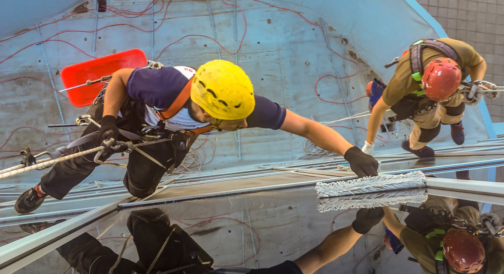

Фасад – визитная карточка здания, его «лицо». По его внешнему виду оценивается и весь комплекс в целом…

К сожалению, яркие цвета и элегантные декоративные элементы оформления блекнут со временем. Кроме того, они собирают на своей поверхности тонны пыли, грязи и строительного мусора. В условиях большого города эта проблема становится все более актуальной.

Но специалистам компании «Снежный Барс» она по плечу.

_К Вашим услугам:_

- мойка окон и фасадов;
- мытье витрин;
- очищение поверхностей и сложных конструктивных элементов на любой высоте.

Все работы выполняют опытные альпинисты. Мытье окон осуществляется с использованием современных средств торговой марки Karcher.

## Мытье витрин, окон и фасадов. Тонкости процесса

Правильно подобранный инструмент, химические средства и грамотно составленный план выполнения клининговых работ на высоте — это уже 90% результата. Специалисты “Снежного барса” планируют проведение верхолазных работ, учитывая все факторы, такие как график работы комплекса, активный траффик пешеходов и транспорта в зоне выполнения работ и другие нюансы. Мойка окон, фасадов и стеклянных поверхностей – не исключение.

Процесс очистки стеклянных фасадов и окон верхолазами:

- _Подготовка верхолазных работ._ Особого подхода требует мойка зданий альпинистами, в зонах постоянного потока посетителей и скопления транспорта. При организации клининговых и других высотных работ в городских условиях, мы особое внимание уделяем безопасности и часто, выполняем работы по мойке фасадов в ночное время. Это позволяет выполнить работы, не принося дискомфорта посетителям и сотрудникам комплекса.
- _Очистка стекла и других поверхностей._ На всю площадь, с помощью специального ворсового скребка или пеногенератора, наносится очищающий состав. Он растворяет частицы городской копоти и солей, смешивая их с водой и пеной. Для пористых поверхностей, или фасадов производственных зданий, этот этап дополняется гидроструйной очисткой высокого давления. 
- _Очищение фурнитуры и рам._ Мойка окон, витрин предполагает мойку не только стеклянной поверхности. Вспомогательные конструкции также нуждаются в чистке. В зависимости от материала, из которого они изготовлены, подбираются индивидуальные средства ухода.
- _Сушка._ Качественная мойка окон и витрин обязательно предполагает удаление лишней влаги с поверхности. Они производится с помощью резинового скребка и протирочного материала. В противном случае, высыхая «на ветру», стекло приобретет неопрятный вид.
- - _Придание стеклам блеска с использованием специальных средств._ При необходимости, [промышленными альпинистами](/ru/blog/promyshlennyi-alpinizm/) «Снежного Барса» проводится полировка фасадных поверхностей, что придает зданию поистине ослепительный вид.

  

  

## Стоимость мойки фасадов альпинистами

Специалисты компании «Снежный Барс» осуществляют мытье окон, фасадов с использованием лучших средств и по современной технологии. Мы гарантируем безупречную очистку даже самых «капризных» поверхностей. Цена таких работ определяется в каждом случае индивидуально. И зависит от конструктивных особенностей здания, степени загрязнений и других факторов:

- сложности конструкции. Мойка фасадов дизайнерского типа и окон с декоративным оформлением под силу разве что опытным профессионалам. Которые не только придадут блеск архитектурной композиции, но и сохранят ее первозданный вид;
- высоты конструкций и степени сложности доступа к ним. Промышленные альпинисты компании «Снежный Барс» производят мойку окон и фасадов с помощью специального снаряжения. Поэтому, у них есть возможность очищать здания высотой более 40 метров. Также, осуществляется и мытье фасадов, имеющих сложное строение. Исходя из проблематичности реализации работ, цены формируются на соответствующем уровне;
- степени загрязнения поверхности. Вспомните, когда в последний раз осуществлялось качественное очищение фасадов, окон. Менее или более полугода назад? В зависимости от этого будет определяться стоимость обслуживания. Самой трудоемкой частью работ является послеремонтное мытье окон. Цены в данном случае определяются, исходя из необходимости удаления остатков краски, клея, цемента, пены, шпатлевки и т.п.

Ищете надежного подрядчика, для выполнения клининговых работ на высоте? [Альпинисты](/ru/) компании «Снежный Барс» – те самые специалисты, которые Вам нужны. Мы гарантируем, что мойка окна и фасадной поверхности будет осуществлена в кратчайшие сроки и с соблюдением всех норм техники безопасности и требований Охраны Труда. 
