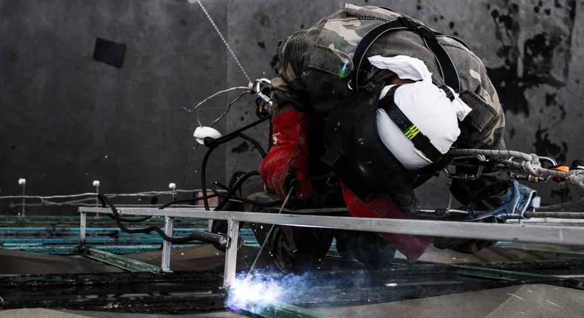

Наружная реклама – это имидж вашей компании. И поэтому так важен монтаж рекламных конструкций именно в том месте, где это наиболее актуально для бизнеса. Но, в большинстве случаев, вам не обойтись без монтажных высотных работ. В целях безопасности, мы настоятельно рекомендуем вам обратиться к профессионалам.

## Монтажные работы на любой высоте

Промышленные альпинисты компании “Снежный барс” готовы помочь в установке даже нестандартных видов рекламы. Монтаж возможен в самых разнообразных местах. Например, на фасадах и крышах зданий, билбордах или над дорогами. Другими словами, везде, где для этого есть соответствующая площадь и опоры. Не бойтесь создавать креативную и необычную рекламу. Ведь ее цель — запомниться покупателю. А опытные альпинисты-высотники компании “Снежный барс” возьмут монтаж рекламных конструкций на себя.

Установленную рекламу необходимо постоянно поддерживать в хорошем состоянии. Её нужно мыть, обслуживать и производить замену вышедшего из строя оборудования. Неблагоприятные погодные условия могут привести к ржавлению деталей конструкции. Для предотвращение травматизма, такие элементы нужно вовремя заменять. Со временем, реклама устаревает или теряет актуальность. И тогда ее необходимо убрать или заменить на новую. Иногда рекламу нужно переместить. Для этого необходимо аккуратно снять конструкцию и собрать в другом месте. Все это также входит в сферу деятельности [промальпа](/ru/blog/promyshlennyi-alpinizm/).

## Спектр верхолазных работ с фасадными рекламными конструкциями

Компания “Снежный барс” предоставляет услуги промышленного альпинизма по сервису наружной рекламы. Он включают в себя монтаж и демонтаж:

- баннеров;

- растяжек над дорогами;

- рекламных щитов;

- световых коробов;

- нестандартных рекламных конструкций;

- фасадных вывесок;

- брандмауэров (размером более 100м2)

Кроме того, мы также выполняем мойку рекламных конструкций и баннеров. Конечно, пыльная и грязная реклама никогда не привлечет покупателя. Поэтому так важно позаботиться об эстетичности вашей вывески.

Альпинисты компании “Снежный Барс” обладают большим опытом в самых разных сферах высотных работ. Благодаря этому, монтаж и демонтаж рекламы осуществляется быстро, качественно и надежно. К тому же, в зависимости от обстоятельств, установка рекламных конструкций возможна и в ночное время.

