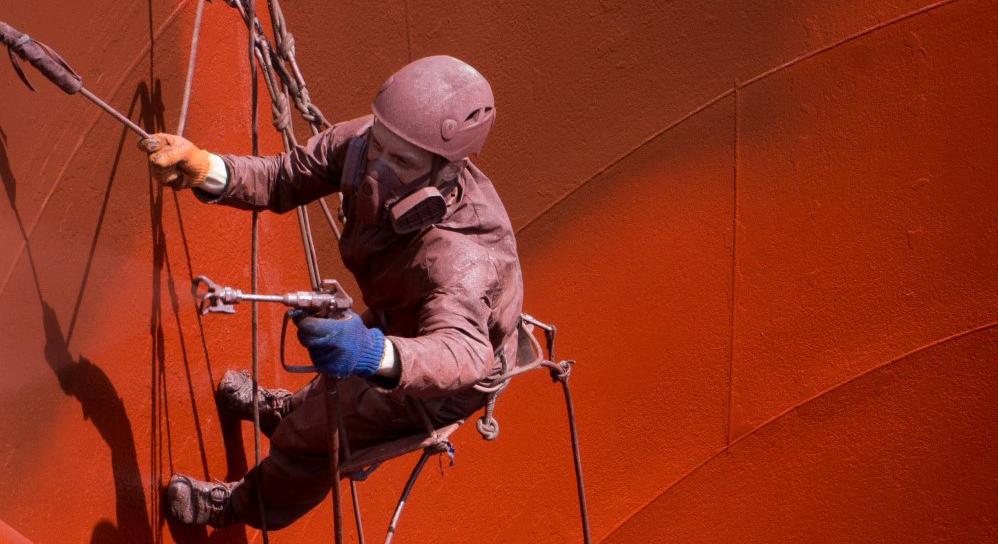

## Безвоздушная покраска, нанесение специальных покрытий верхолазами

Компания Снежный Барс — это команда квалифицированных альпинистов. В распоряжении которых современное оборудование для механизации процессов нанесения различных антикоррозионных и других систем покрытий. Например, [покрасочные станции](/ru/blog/arenda-i-prodazha-oborudovaniya/) от мировых технологических брендов Graco, Titan и Wagner. Наши верхолазы всегда выполнят поставленные задачи наилучшим образом. Поэтому, если вам нужен качественный результат — вы обратились по адресу.

## Внутренняя отделка и гидроизоляция помещений

Почти каждый вид поверхности требует определенного вида защиты. Будь-то пол, стены или крыша. Шпаклевка, например, кроме своей основной функции (заполнения неровностей, заделки стыков или швов) имеет и декоративное значение. Согласитесь, намного приятнее находиться в теплом и просторном помещении, с ровными стенами и приятным цветовым оформлением. [Нанесение финишной шпаклевки](/ru/services/provedenie-vnutrennix-rabot/) нашими мастерами производится механизированным способом. Аппарат гидропоршневого типа распыляет материал на стены или потолок. Кроме того, технология безвоздушного нанесения краски дает идеально равномерное декоративное покрытие. Внутренние малярные работы и верхолазные работы по нанесению защитных покрытий наши специалисты производят именно этим методом.

## Безвоздушное нанесение покрытий промальпинистами

Кроме внутренней отделки, так же очень важна внешняя защита зданий и сооружений. Если она уже не в идеальном состоянии — мы можем это изменить. В спектр наших услуг входит [герметизация крыши жидкой резиной](/ru/blog/gidroizolyaciya-zhidkoj-rezinoj-za-ili-protiv/) и нанесение других специальных защитных покрытий. 
Наши специалисты имеют опыт работы в специфических условиях различных промышленных предприятий. С использованием современных материалов высокой вязкости. В том числе двукомпонентными эпоксидными покрытиями, которые не допускают добавления разбавителей, для уменьшения вязкости.
Такие покрытия защищают сооружения от разрушительного воздействия особо агрессивной среды, и часто применяются на пищевых производствах, в т.ч для поверхностей силосов и резервуаров, где к лакокрасочным материалам представляют особые требования.

Но не только сам специализированный материал и технология нанесения сказываются на качестве такой защиты. Подготовка поверхности перед нанесением защитного слоя – играет решающую роль в эксплуатационных характеристиках, долговечности и эффективности такой защиты. Если на поверхности останутся частицы мусора — это приведет к появлению воздушного пространства и некачественному сцеплению материалов с основой. Поэтому для нас очень важно исполнить каждый этап своей работы профессионально и эффективно.

## Перечень нанесения специальных покрытий:

- внутренние малярные работы: механизированное нанесение финишной шпаклевки, грунтовка, покраска, подготовка стен под обои и покраску;
- герметизация кровли жидкой резиной;
- герметизация перекрытий полиуретановыми составами;
- [антикоррозийная защита металлоконструкций.](/ru/services/pokraska-metalla/);
- герметизация и обработка силосов вязкими составами;

Наши услуги доступны для общественных и офисных помещений, паркингов, спорткомплексов различных производств и цехов и т. д. Мы можем выполнять задачи разной сложности в кратчайшие сроки и без потери качества.

Мы готовы предложить удобные и выгодные для Вас варианты сотрудничества. Для уточнения стоимости работ по Вашему техническому заданию, обратитесь к нашим специалистам. Наши консультанты всегда предоставят вам всю необходимую информацию.

