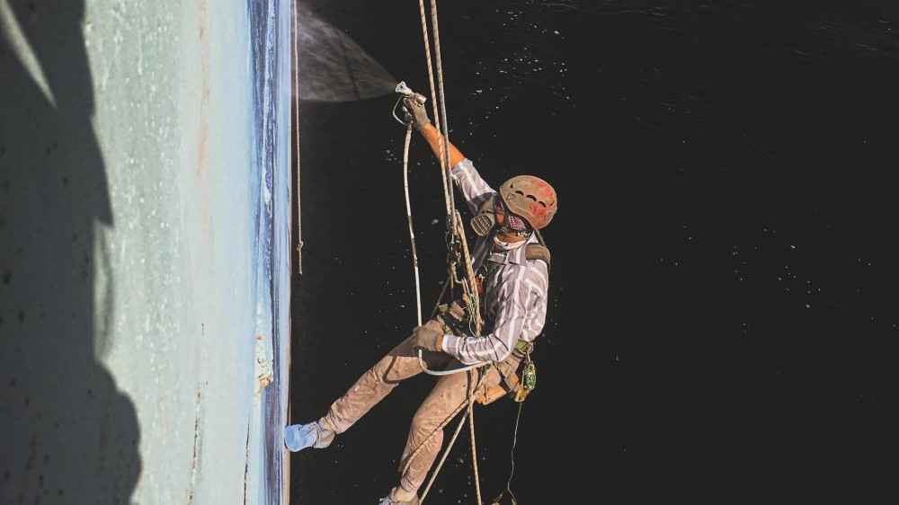

## Покраска фасадов и конструкций на высоте

Работы нужно провести быстро, аккуратно и с высокой степенью точности? Все эти и многие другие преимущества гарантируют вам профессиональные альпинисты нашей компании. Маляры-высотники работают без строительных лесов и специальной техники. Кроме того, все работы будут выполнены с соблюдением всех технологических норм. Начиная с подготовки поверхности до непосредственного нанесения краски.

Ведь мы понимаем, что именно от качества подготовки к покраске зависит то, как долго прослужит новое лакокрасочное покрытие. Она состоит из очистки от старых слоев краски, обезжиривания, обеспыливания, грунтовки и т.д.

В так называемой «старой» части города услуги альпинистов будут особенно востребованы. Компания «Снежный барс» быстро и аккуратно проведет фасадные работы. Мы не используем громоздкую технику, которая не слишком уместна на узких улицах исторических кварталов.

Также, часто невозможно установить леса и люльки на действующих предприятиях. Особенно там, где в зоне выполнения работ находится оборудование. Или постоянный поток транспорта и людей. В таком случае единственное решение — это выполнять работы “с веревок”. То есть, методом промышленного альпинизма.

## Почему стоит доверить малярные и другие верхолазные работы нам?

Многолетний опыт работы “Снежного Барса” показал, как важно не только качество. Но и соблюдение сроков выполнения покрасочных работ. Благодаря профессиональному оборудованию мы можем окрасить огромные поверхности в минимальные сроки. И при этом не теряя в качестве. Мы работаем гидропоршневыми аппаратами безвоздушного типа. Которые наносят покрытие под давлением. Это оборудование очень надежно. Это позволяет работать, не отвлекаясь на ремонт или замену техники. Кроме того, оно обеспечивает качественное равномерное нанесение (в том числе и “[специальных покрытий](/ru/services/nanesenie-specialnyx-pokrytij/)”).

## Наши верхолазы качественно и быстро выполнят малярные работы:

- для промышленного здания (например, это может быть покраска наружных стен или несущих железобетонных конструкций производственного цеха);
- элеваторных комплексов ([покраска элеваторов](/ru/tipy-obektov/elevatory-promyshlennye-cexa/) с бетонными силосами)
- на гидроэлектростанциях ([покраска плотины ГЭС](/ru/tipy-obektov/elektrostancii-ges-tes-aes/))
- на [мостах и путепроводах](/ru/tipy-obektov/puteprovody-mosty-i-estakady/) (гидроструйная очистка и покраска железобетонных опор)
- нефтебаз и хранилищ жидких материалов (антикоррозионная защита и [покраска наружных стен резервуаров](/ru/tipy-obektov/rezervuary-dlya-zhidkostej/))
- для любых [общественных зданий](/ru/tipy-obektov/obshhestvennye-obekty-trc-vokzaly/): например спорт-комплексов, аквапарков, бизнес-центров, гостиниц, офисных центров или ТРЦ;
- [многоквартирного жилого дома](/ru/services/uteplenie-sten-i-fasadov/) (защита термоизоляционного слоя, гидроизоляция и [покраска крыш](/ru/services/pokraska-kryishi/)).

Создание особого имиджа компании, косметический ремонт, реставрация, защита от коррозии. Все эти и многие другие задачи позволит решить [покраска фасада](/ru/services/pokraska-fasada/). Стоимость работ зависит от многих факторов.  Это объем заказа, его сложность, сроки исполнения и другие особенности. Вам нужно только сформулировать задачу. А её надежное исполнение обеспечат специалисты «Снежного барса»!
