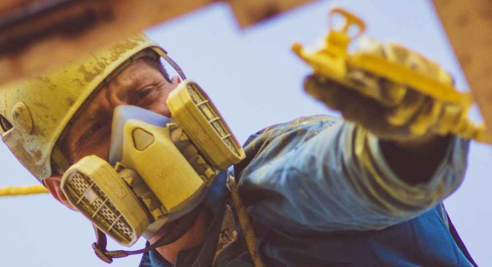

## Очистка и покраска фасадов зданий верхолазами 

Любой фасад, без постоянного ухода, со временем становится непривлекательным. Промышленная и городская пыль, неблагоприятные погодные условия и другие факторы оказывают негативное влияние на покрытие зданий. [Покраска фасада](/ru/services/pokraska-betonnyh-konstrukcij/) может отлично решить эту проблему. К тому же, благодаря разнообразию цветов краски, вы можете легко освежить внешний вид любого здания. Будь то здание главного офиса предприятия или многоквартирный жилой комплекс.

## Почему стоит воспользоваться услугами высотников?

[Промышленный альпинизм](/ru/) чаще всего используется, когда доступ к определенным конструкциям и элементам зданий ограничен. А применение стандартных методов работы проблематично. Наши высококвалифицированные промышленные альпинисты легко выполнят покраску любых фасадов.

Потребность в промышленном альпинизме растет с каждым годом. Наши мастера используют только лучшее оборудование для обеспечения безопасности на сегодняшний день. В том числе и специальное альпинистское снаряжение. Дополнительно, это дает возможность избежать высоких затрат и потерь времени на обустройство люлек или лесов. В своей работы мы применяем обширные знания и большой опыт специалистов компании.  

Наши специалисты учитывают индивидуальные особенности каждого объекта. Кроме того, мы изучаем наиболее подходящие отделочные материалы и покрытия.  Анализируем степень загрязнения и местоположение. И, только тогда, предлагаем лучшее из доступных решений.

## Мы качественно и быстро выполним покрасочные работы:

- офисных и торговых комплексов;
- [промышленного здания](/ru/tipy-obektov/elevatory-promyshlennye-cexa/) (например, это может быть покраска наружных стен производственного цеха);
- многоквартирного жилого дома;
- любых [коммерческих зданий](/ru/tipy-obektov/obshhestvennye-obekty-trc-vokzaly/): например, бизнес-центров, гостиниц или магазинов.

## Этапы подготовки и окраски фасадов

### Очистка фасада 

 Перед покраской необходимо провести качественную очистку окрашиваемых поверхностей. Ее нужно обеспылить и обезжирить. Если присутствует поврежденная старая краска — её необходимо снять. Часто, для этих целей, альпинисты применяют гидроструйную очистку фасада давлением 200 бар.

### Восстановление поверхности

 Перед нанесением лакокрасочных материалов, нужно проверить здание на наличие поврежденных участков. Если таковые имеются — проводится ремонт.

### Безвоздушная покраска 

 В своей работе мы используем только высококачественные материалы и лакокрасочные системы. Это также касается и оборудования. Наши маляра-высотники окрашивают стены с помощью аппаратов высокого давления для безвоздушного нанесения. Он равномерно наносит покрытие, не оставляя мазков и проплешин.

## Важные нюансы при окраске фасадов

Кроме придания “свежего облика” зданию, покраска отлично защищает фасад от воздействия внешней среды. Иногда, под слоем пыли и старой краски тяжело заметить участки коррозии или других повреждений. Но, вовремя проведенная дефектовка и покраска наружных стен здания, может предотвратить более неприятные последствия.

Также, сложным моментом является покраска исторических объектов. Для проведения таких работ, нужно обладать отличными навыками и большим опытом. Ведь очень часто, облицовка таких объектов достаточно хрупкая. Строительные леса и подъемники в узких исторических улочках неуместны, а строительные люльки могут нанести повреждения ценным элементам сооружения. В таких случаях, очистка и покраска фасадов проводится «с веревок» промышленными альпинистами.

[Стоимость работ](/ru/prajs/) рассчитывается индивидуально для каждого объекта. Подробнее об услугах “Снежного Барса” вы можете узнать у наших специалистов. Номера телефонов и электронную почту для связи с нашими высотниками легко найти в блоке [контакты](/ru/contacts/). Или задайте Ваш вопрос, через форму обратной связи.

