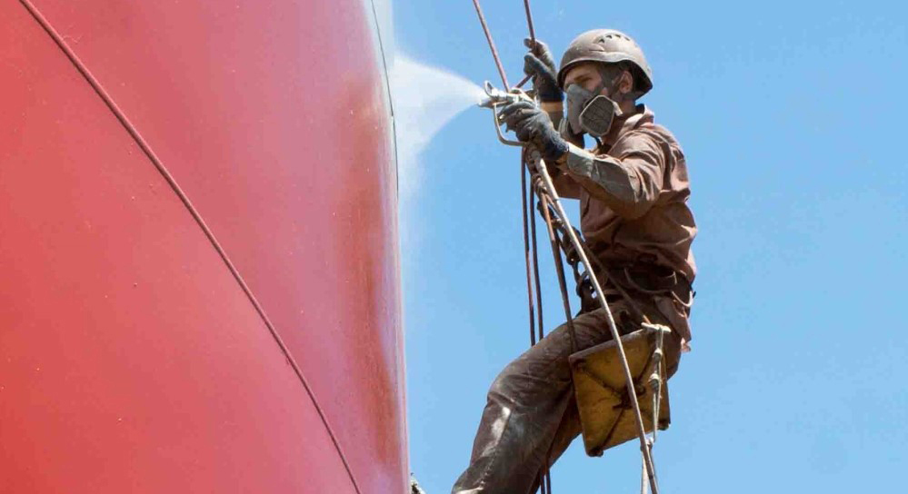

Покраска металлоконструкций от Снежный Барс - это максимально механизированный процесс.

"Безотказное", мощное оборудование для безвоздушного нанесения покрытия, позволяет окрашивать большие объемы металлоконструкций (в т.ч. вязкими материалами) на высоте бесперебойно.

Для покраски металлоконструкций мы используем покрасочные станции гидропоршневого типа производства мировых лидеров: брендов Graco, Wagner, Titan. Благодаря высокотехнологичному оборудованию,  производим обработку и окрашивание металла качественно и быстро, без потери времени на ремонт и техобслуживание.

Заполните [эту форму](/ru/inquiry/) и получите подробное Коммерческое Предложение за 24 часа. 

## МЕТОДЫ ПОКРАСКИ МЕТАЛОКОНСТРУКЦИЙ

Покраска металла альпинистами «Снежного Барса» производится в соответствии со всеми нормами и правилами. Мы руководствуемся государственными Строительными Нормами и международными стандартами. Выполняем весь необходимый цикл работ:

- Подбор оптимальной антикоррозионной системы
- Подготовка металлических поверхностей к окраске
- Нанесение [антикоррозийной защиты](/ru/blog/zashhita-metallov-ot-korrozii/)
 
При покраске металлических конструкций мы придерживаемся рекомендаций производителей лакокрасочных материалов. Мы применяем различные технологии и методы нанесения, в соответствии с Техническим Заданием и производственными условиями на объекте.

### ОБЕЗЖИРИВАНИЕ ПОВЕРХНОСТИ МЕТАЛЛА

При необходимости, перед покраской металлоконструкций альпинисты удаляют слои масляных отложений с поверхности. Чаще всего, такая очистка требуется в зонах редукторов грузоподъемных кранов и в местах подтеканий смазочных материалов возле движущихся механизмов.

### Гидроструйная очистка металлоконструкций

Без образования пыли, струи воды под давлением не менее 180 бар снимают слабые слои старых окрасочных материалов с поверхностей металлических конструкций. Кроме того, верхолазы применяют грязевые фрезы. Такой метод позволяет не только очистить поры окрашиваемого металла от мельчайших частиц загрязнений, но и снять окалину с пораженных коррозией труднодоступных участков металлоконструкции.

### Безвоздушная покраска металлоконструкций

При покраске металлических конструкций наши альпинисты используют покрасочные аппараты высокого давления ведущих мировых производителей. Надежное оборудование позволяет нам качественно выполнять работы на высоте более 20 м. и укладываться в минимальные сроки.

### Окрашивание металла ручным методом 

Иногда, производственные условия не позволяют распылять лакокрасочные материалы на высоте. Чаще всего, в производственных цехах пищевых предприятий покраску несущих конструкций из металла наши верхолазы производят вручную.

## ПРОФЕССИОНАЛЬНАЯ ПОКРАСКА МЕТАЛЛОКОНСТРУКЦИЙ

«Снежный Барс» имеет опыт и оборудование для выполнения покраски металлоконструкций, обработки огнезащитой, сложными двукомпонентными полиуретановыми и эпоксидными покрытиями, безвоздушного нанесения материалов высокой вязкости для агрессивных условий эксплуатации. Кроме того, сотрудничество с нами – это всегда:

- **Высокая квалификация.** Опытные специалисты, мощное оборудование, знание технологий;
  
- **Покраска металла методом промальпинизма.** Без люлек, лесов и подъемников;
  
- **Порядок в документации.** Разрешительная документация, акты строительных работ, сметы;
  
- **Соблюдение строительных норм и требований ОТ.** Разрешение на выполнение работ повышенной опасности, удостоверение о квалификации и мед.справки на каждого высотника.
  

## ГАРАНТИИ НА АНТИКОРРОЗИОННУЮ ЗАЩИТУ И ПОКРАСКУ МЕТАЛЛОКОНСТРУКЦИЙ

Альпинисты Снежного Барса выполняют согласно Строительных Норм и международных стандартов.

На всех стадиях процесса, от подготовки металлической поверхности, до нанесения финишного покрытия на металлоконструкции, наши специалисты четко придерживаются рекомендаций производителя лакокрасочных материалов и технологических карт.

Поэтому, на все выполненные работы наша компания предоставляет гарантию на стойкость антикоррозийного покрытия, в соответствии с характеристиками антикоррозионной системы и условий эксплуатации. В случае наступления гарантийного случая, мы восстановим покрытие за свой счет.

## СТОИМОСТЬ ПОКРАСКИ МЕТАЛЛОКОНСТРУКЦИЙ ФОРМИРУЕТСЯ, ИСХОДЯ ИЗ:

- объема работ;
  
- формы и сложности металлической конструкции;
  
- высоты, на которой располагается объект;
  
- сложности доступа к конструкции и ее отдельным элементам;
  
- текущего состояния поверхности металлоконструкции.

**[Цена](/ru/prajs/)** учитывает длительность и трудоемкость процесса очистки и подготовки металла к нанесению лакокрасочных систем.

Покраска металлоконструкций доступна в Киеве или любом другом уголке Украины. Она производится квалифицированными альпинистами с гарантией качества и в кратчайшие сроки.

Позвоните уже сейчас, и мы предложим Вам выгодные цены и условия сотрудничества!

