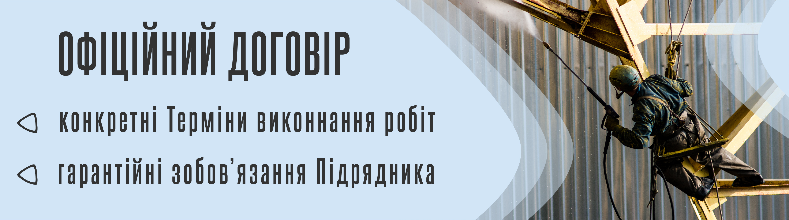
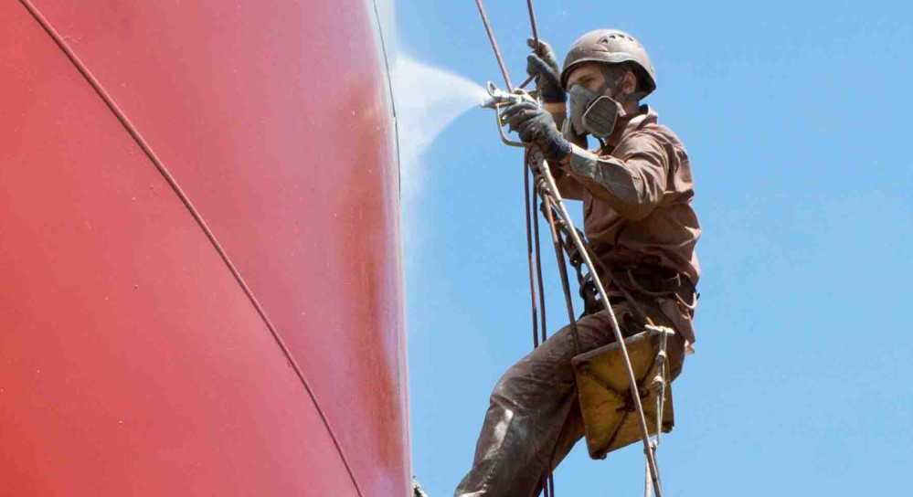

Фарбування металоконструкцій від Сніжний Барс - це максимально механізований процес.

"Безвідмовне", потужне обладнання для безповітряного нанесення покриття, дозволяє фарбувати великі обсяги металоконструкцій (в т.ч. в'язкими матеріалами) на висоті безперебійно. 

Для фарбування металоконструкцій ми використовуємо фарбувальні станції гідропоршневого типу виробництва світових лідерів: брендів Graco, Wagner, Titan. Завдяки високотехнологічному устаткуванню, обробляємо та фарбуємо метал якісно і швидко, без втрати часу на ремонт і техобслуговування. 

Заповніть [цю форму](/inquiry/) і отримайте детальну Комерційну Пропозицію за 24години. 

## МЕТОДИ ФАРБУВАННЯ МЕТАЛОКОНСТРУКЦІЙ

Фарбування металу альпіністами «Сніжного Барса» проводиться у відповідності до усіх норм і правил. Ми керуємося державними Будівельними Нормами і міжнародними стандартами. Проводимо весь необхідний цикл робіт:

- Підготовка металевих поверхонь до фарбування
  
- Підбір оптимальної антикорозійної системи
  
- [Нанесення антикорозійного захисту](/blog/zashhita-metallov-ot-korrozii/)
  
  
### ЗНЕЖИРЕННЯ ПОВЕРХНІ МЕТАЛУ

За необхідності, з поверхні металоконструкцій альпіністи видаляють шари олійних відкладень. Найчастіше, таке механічне або хімічне очищення необхідне в зонах редукторів вантажопідіймальних кранів і в місцях підтікань мастильних матеріалів біля рухомих механізмів.

### ГІДРОСТРУМИННЕ ОЧИЩЕННЯ МЕТАЛОКОНСТРУКЦІЙ

Без утворення пилу, струмені води під тиском не менше 180 бар знімають слабкі шари старих лакофарбових матеріалів з поверхні металевих конструкцій. Крім того, верхолази застосовують грязьові фрези. Такий гідродинамічний метод дозволяє не тільки очистити пори метала від найдрібніших частинок забруднень, але і зняти окалину з уражених корозією важкодоступних ділянок металоконструкції.

### БЕЗПОВІТРЯНЕ ФАРБУВАННЯ МЕТАЛОКОНСТРУКЦІЙ

При фарбуванні металоконструкцій наші альпіністи використовують фарбувальні апарати високого тиску провідних світових виробників. Надійне обладнання дозволяє нам якісно виконувати роботи на висоті понад 20 метрів і укладатися в мінімальні терміни.

### ФАРБУВАННЯ МЕТАЛУ РУЧНИМ МЕТОДОМ 

Іноді, виробничі умови не дозволяють розпилювати лакофарбові матеріали на висоті. Найчастіше, в виробничих цехах харчових підприємств фарбування несучих конструкцій наші верхолази проводять вручну.

## ПРОФЕСІЙНЕ ФАРБУВАННЯ МЕТАЛОКОНСТРУКЦІЇ:

«Сніжний Барс» має досвід і обладнання для виконання фарбування металоконструкцій, обробки вогнезахистом, складними двокомпонентними поліуретановими і епоксидними системами. А також, безповітряного нанесення спеціальних покриттів: матеріалів високої в'язкості, для агресивних умов експлуатації. Крім того, співпраця з нами – це завжди: 

- **Висока кваліфікація.** Досвідчені спеціалісти, потужне обладнання, знання технологій).
  
- **Фарбування металу методом промальпінізму.** Без люльок, риштувань і під’йомників
  
- **Порядок в документації.** Дозвільна документація, акти буд.робіт, кошториси, тощо;
  
- **Дотримання Будівельних Норм і вимог ОП.** Дозвіл на виконання робіт підв. небезпеки, посвідчення про кваліфікацію і мед.довідки на кожного висотника.

## ГАРАНТІЇ НА АНТИКОРОЗІЙНИЙ ЗАХИСТ ТА ФАРБУВАННЯ МЕТАЛОКОНСТРУКЦІЙ

Всі фарбувальні роботи альпіністи Сніжного Барса виконують згідно будівельних норм і міжнародних стандартів.

На всіх стадіях виконання робіт, від підготовки металевої поверхні, до нанесення фінішного покриття на металоконструкції, наші фахівці чітко дотримуються рекомендації виробника лакофарбових матеріалів і Технологічних Карт.

Тому, на всі виконані роботи наша компанія надає гарантію на стійкість антикорозійного покриття, відповідно до характеристик антикорозійної системи і умов експлуатації.
В разі настання гарантійного випадку, ми відновимо покриття за власний рахунок.

## ВАРТІСТЬ ФАРБУВАННЯ МЕТАЛОКОНСТРУКЦІЙ ЗАЛЕЖИТЬ ВІД:

- обсягу робіт;
  
- форми і складності металевої конструкції;
  
- висоти, на якій розташовується об'єкт;
  
- складності доступу до конструкції та її окремих елементів;
  
- поточного стану поверхні металоконструкції, тощо.
  
**[Ціна](/prajs/)** враховує тривалість і трудомісткість робіт з очищення та підготовки металу до нанесення лакофарбових систем.

Фарбування металоконструкцій доступне в Києві або будь-якому іншому куточку України. Такі будівельні роботи проводяться кваліфікованими альпіністами з гарантією якості і в найкоротші терміни. 

Зателефонуйте вже зараз! І ми запропонуємо Вам вигідні ціни та умови співпраці!

