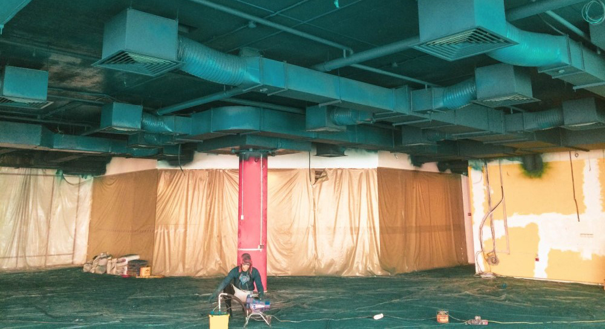

## Малярные работы в кратчайшие сроки

Внутренние малярные работы от компании «Снежный Барс» — это финишная шпаклевка механизированным способом (подготовка стен под покраску или обои) и, собственно, безвоздушная покраска. 

[Команда специалистов “Снежного барса”](/ru/) состоит из профессиональных маляров и мастеров по внутренним работам. Мы выполняем работы по шпаклевке и покраске аппаратным методом. Это позволяет в разы ускорить процесс без потери качества. Кроме того, наша услуга по механизированной шпаклевке доступна по всей Украине при больших объемах (от 1000м2), и в Виннице (от 300м2)

## Список отделочных работ, выполняемых нашими малярами:

- подготовка и очистка поверхности от пыли и мусора;
- механизированная шпаклевка стен под обои;
- шпатлевание стен под покраску;
- поклейка стеклохолста;
- затирка и подготовка стен к последующей обработке;
- грунтование;
- безвоздушная покраска стен;
- шпатлевка потолков под покраску;
- безвоздушная покраска потолков.

## Почему стоит доверить нам внутренние работы?

Для нас очень важно удовлетворить все потребности заказчика. В том числе и эстетические. Все процессы по внутренней отделке строго контролируются. И с точки зрения качества исполнения, и для соблюдения техники безопасности.

В своей работе мы используем только наилучшее [оборудование](/ru/blog/arenda-i-prodazha-oborudovaniya/). Это позволяет быстро и без огрехов справиться с большими объемами. Основным инструментом для шпатлевки, грунтовки и покраски является аппарат гидропоршневого типа. Его используют для [нанесения специальных покрытий](/ru/services/nanesenie-specialnyx-pokrytij/) и вязких материалов. Аппарат распыляет их безвоздушным методом. Это позволяет подготавливать стены и потолки в кратчайшие сроки (от 150м2 за день).

Тщательно отнеситесь к выбору ремонтной компании. Наилучшим вариантом будет та организация, которая сможет обеспечить управление всеми процессами  одновременно. Мастера должны легко устранять перекрестные помехи и конфликты. Кроме того, всегда нужны гарантии, что при проведении работ ничего не будет упущено.

Мы можем провести первоначальный осмотр и дать оценку стоимости вашего проекта в течение нескольких дней. Больше о спектре предоставляемых услуг вы можете узнать на нашем сайте. А обсудить ваши требования более подробно, позвонив (096) 555-30-92. 

Качество, быстрота и надежность — наши основные принципы работы. И мы уверенно заявляем, что полностью их придерживаемся. Также, наши специалисты всегда готовы предложить удобные и выгодные вам условия для сотрудничества.
